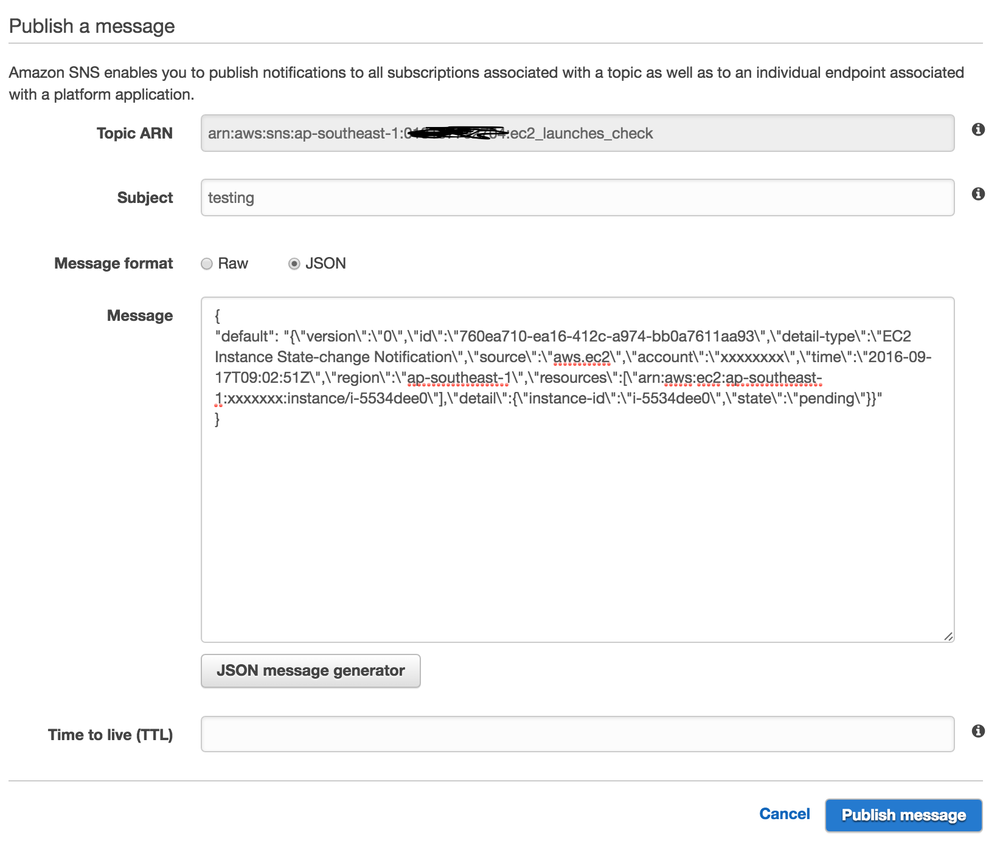

Requirement
-----

- Install [webtask clent](https://webtask.io/cli)
- Get yourself a very strict policy controlled AWS credentials
- Create one SNS topic and allow your aws credentials 'publish' only privileges


Create and Add following secrets to webtask
-------------------------------------

- AWS_REGION
- AWS_ACCESS_KEY_ID
- AWS_SECRET_ACCESS_KEY
- ALERT_TOPIC_ARN


Create strict IAM policy
-----

__policygen-ec2-tags-ro-webtask-201609171532__

``` json
{
    "Version": "2012-10-17",
    "Statement": [
        {
            "Sid": "Stmt1474106403000",
            "Effect": "Allow",
            "Action": [
                "ec2:DescribeInstanceAttribute",
                "ec2:DescribeInstanceStatus",
                "ec2:DescribeInstances",
                "ec2:DescribeKeyPairs",
                "ec2:DescribeReservedInstances",
                "ec2:DescribeReservedInstancesListings",
                "ec2:DescribeSecurityGroups",
                "ec2:DescribeTags"
            ],
            "Resource": [
                "*"
            ]
        }
    ]
}
```

__policygen-sns-publish-webtask-201609171542__

``` json
{
    "Version": "2012-10-17",
    "Statement": [
        {
            "Sid": "Stmt1474107060000",
            "Effect": "Allow",
            "Action": [
                "sns:Publish"
            ],
            "Resource": [
                "arn:aws:sns:ap-southeast-1:xxx:ec2_audit_alert"
            ]
        }
    ]
}
```


How to run
-----


- Create webtask


```
    wt create ec2_tag_check.js -s AWS_REGION=XXX \
                                -s  AWS_ACCESS_KEY_ID=XXX \
                                -s AWS_SECRET_ACCESS_KEY=XXX  \
                                -s ALERT_TOPIC_ARN=xxx

```

How to test
--------

Instead of launching instances and wait for it to publish event for you, you can directly invoke publish from AWS console using undersigned payload. Just change the `instance-id` and you are good to go.

```
{
"default": "{\"version\":\"0\",\"id\":\"760ea710-ea16-412c-a974-bb0a7611aa93\",\"detail-type\":\"EC2 Instance State-change Notification\",\"source\":\"aws.ec2\",\"account\":\"xxxx\",\"time\":\"2016-09-17T09:02:51Z\",\"region\":\"ap-southeast-1\",\"resources\":[\"arn:aws:ec2:ap-southeast-1:xxxxx:instance/i-b934de1e\"],\"detail\":{\"instance-id\":\"i-5734def0\",\"state\":\"pending\"}}"
}
```
Follow the screenshot if stuck anywhere



